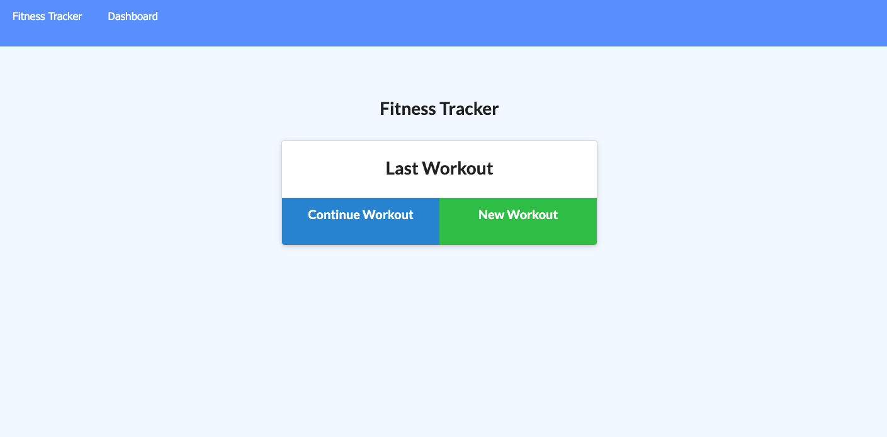

# Workout Tracker

## Description
Workout Tracker is an app to track user's daily resistance and cardio workouts. The user can also view their last 7 workouts in their dashboard through graphs to help visualize progress.
## Table of Contents

- [Workout Tracker](#workout-tracker)
  - [Description](#description)
  - [Table of Contents](#table-of-contents)
  - [Installation](#installation)
  - [Usage](#usage)
  - [License](#license)
  - [Tests](#tests)
  - [Contributing](#contributing)
  - [Questions](#questions)
  - [Deployed Application](#deployed-application)

## Installation
***
Simply used the deployed version or run npm i to create a locally hosted version!

## Usage
***
Due to the nature of the app, the deployed version will not seperate your data from another user's data. For a personalized experience, please download and host a local version.

## License
***
Unlicensed

## Tests
***
None at this time

## Contributing
***
If you would like to contribute please email me

## Questions
If you have further questions, suggestions, or business inquiries please contact me via email.  

## Deployed Application  
[Link To Deployed App](https://evening-mountain-82600.herokuapp.com/)  

